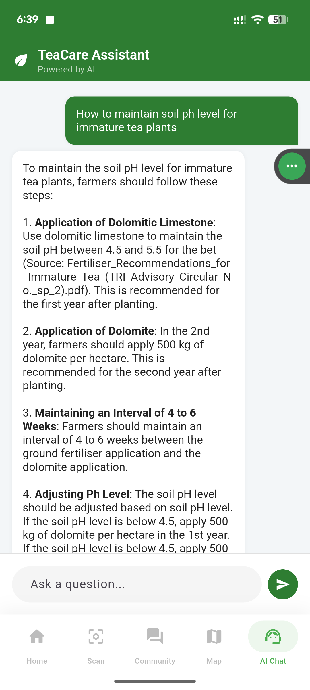
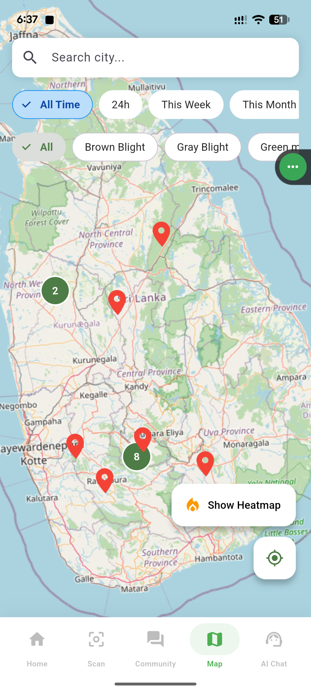
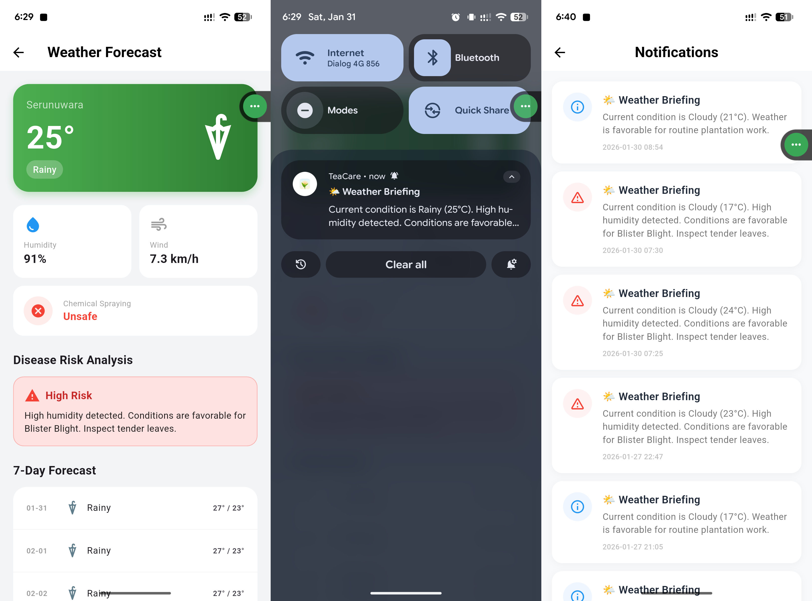
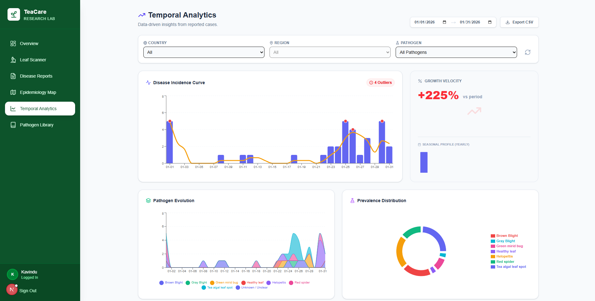
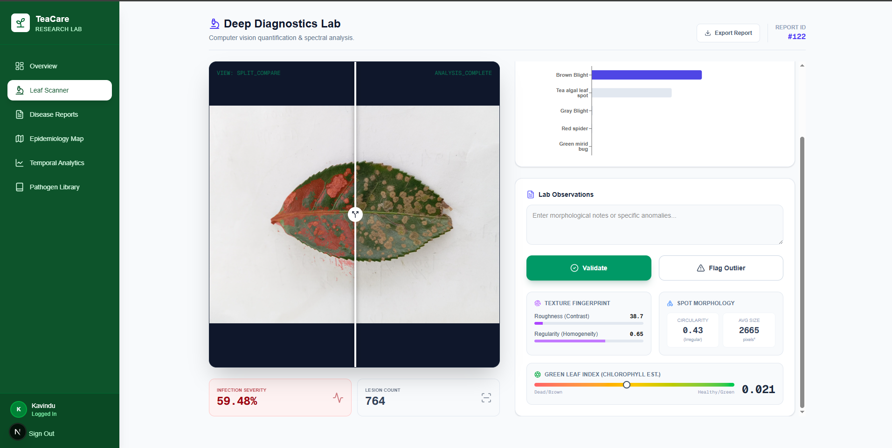
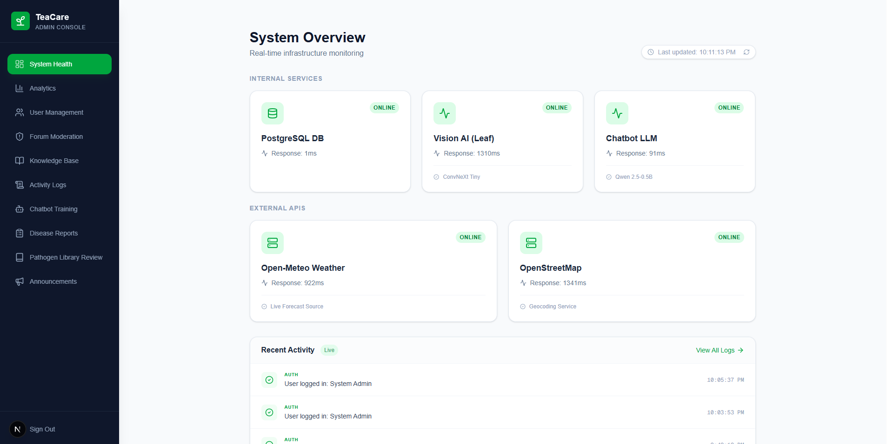
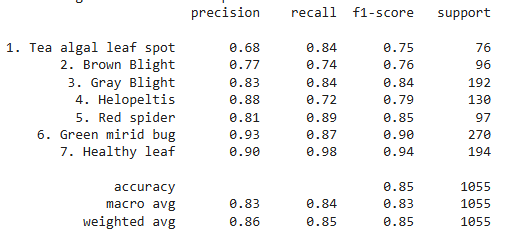
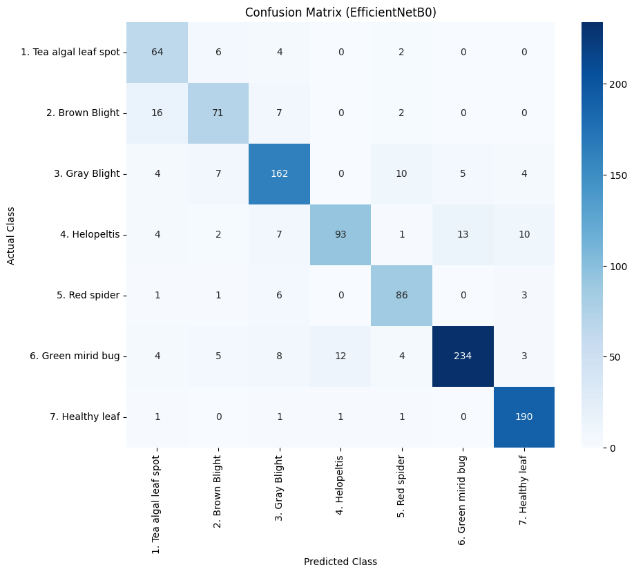
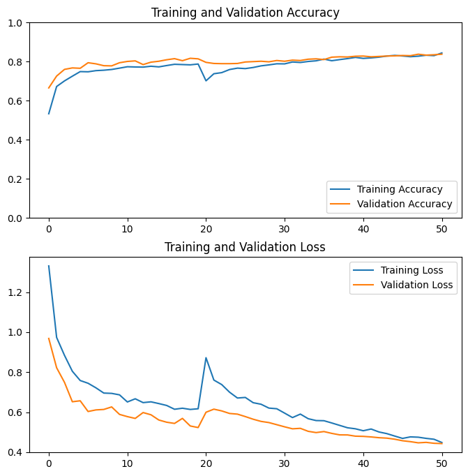

# TeaCare: AI-Powered Tea Plant Disease Identification System 🌱📱

[](https://flutter.dev/)
[](https://fastapi.tiangolo.com/)
[](https://www.python.org/)
[]()

## 📖 Overview

**TeaCare** is a "Digital Doctor" mobile application designed to assist tea farmers in Sri Lanka by identifying plant diseases instantly and providing expert management advice. 

The tea industry suffers from significant yield losses due to diseases, exacerbated by a scarcity of agronomists and delayed manual diagnosis. TeaCare bridges this gap by deploying lightweight, low-latency AI models directly on standard mobile hardware, connecting smallholder farmers with expert-level agronomy knowledge.

---

## ✨ Key Features

### 1. 🍃 Instant Disease Diagnosis (The "Digital Doctor")
* **Function:** Identifies 7 distinct classes of tea leaf conditions in under 2 seconds.
* **Classes Detected:** Tea Algal Leaf Spot, Brown Blight, Gray Blight, Helopeltis, Red Spider, Green Mirid Bug, and Healthy Leaf.
* **Tech:** Powered by a transfer-learning optimized **ConvNeXtTiny** model.


### 2. 🤖 AI Expert Chatbot
* **Function:** Farmers can ask "How do I fix this?" and receive safe, verified answers sourced from official technical manuals.
* **Tech:** Runs on a quantized **Qwen-0.5B** Small Language Model (SLM) optimized for CPU inference.


### 3. 🗺️ Live Disease Geo-Heatmap
* **Function:** A real-time geospatial map that tracks disease outbreaks across regions to help researchers and authorities monitor spread patterns.


### 4. 🌦️ Weather-Based Risk Alerts
* **Function:** A logic-based engine that correlates real-time weather data (humidity, temperature) to forecast fungal disease risks before they spread.
* 







---

## 🏗️ System Architecture

TeaCare is architected for performance on low-end devices, ensuring accessibility for all farmers.

### Tech Stack
* **Frontend (Mobile):** [Flutter (Dart)](https://flutter.dev/) - Selected for cross-platform consistency and native performance.
* **Backend:** [FastAPI (Python)](https://fastapi.tiangolo.com/) - Handles asynchronous inference requests and database orchestration.
* **AI Engine:**
    * **Visual:** ConvNeXtTiny (Transfer Learning).
    * **NLP:** Qwen-0.5B (Quantized).
* **Web Dashboard:** Next.js (for administrative analytics).

---

## 📊 Performance & Results

The system achieved an **Overall Accuracy of 88%** across all test classes.

| Metric | Value | Significance |
| :--- | :--- | :--- |
| **Overall Accuracy** | **88%** | ]Reliable identification across 7 classes. |
| **Healthy Leaf Recall** | **0.99** | Near-perfect reliability in identifying healthy plants, preventing unnecessary chemical usage. |
| **Inference Time** | **< 2s** | Real-time performance suitable for field use. |






---

## 🚀 Getting Started

Follow these instructions to set up the project locally.

### Prerequisites
* Flutter SDK (Latest Stable)
* Python 3.9+
* Node.js (for Web Dashboard)

### 1. Backend Setup
```bash
# Clone the repository
git clone [https://github.com/nimeshkavindu/TeaCare.git](https://github.com/nimeshkavindu/TeaCare.git)
cd TeaCare/backend

# Create virtual environment
python -m venv venv
source venv/bin/activate  # On Windows: venv\Scripts\activate

# Install dependencies
pip install -r requirements.txt

# Run the FastAPI server
uvicorn main:app --reload
```

## 2. Mobile App Setup

To get the mobile application up and running, follow these steps:

```bash
# Navigate to the mobile app directory
cd ../mobile_app

# Get dependencies
flutter pub get

# Configure API URL
# Go to lib/core/constants.dart and set BASE_URL to your local IP

# Run the app
flutter run
```
## 📂 Project Structure
To maintain the alignment of the directory tree, I have placed the structure inside a plaintext code block. This ensures that the lines and spacing remain consistent across different screens.

```bash
TeaCare/
├── mobile_app/      # Flutter Application
│   ├── lib/
│   ├── assets/
│   └── pubspec.yaml
├── backend/         # FastAPI Server & AI Models
│   ├── app/
│   ├── models/      # ConvNeXt and Qwen model files
│   └── main.py
├── web_dashboard/   # Next.js Analytics Dashboard
└── README.md
```
## 📄 License

This project is licensed under the **MIT License** - see the [LICENSE](LICENSE) file for details.
